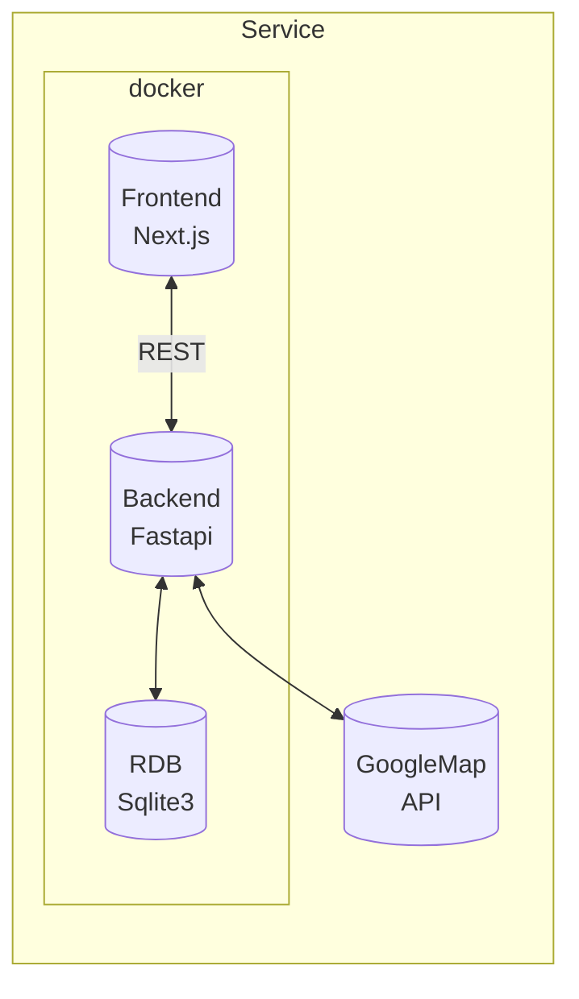

# 城巡りアシスタントアプリケーション
## システム構成図

```mermaid
flowchart LR
    subgraph Service
    subgraph docker[docker]
        front[("Frontend \n Next.js")]
        back[("Backend \n Fastapi")]
        rdb[("RDB \n Sqlite3")]
        %% nosql[("NoSql \n MongoDB")]
        front <--"REST"--> back
        back <--> rdb
        %% back <--> nosql
    end
    api[("GoogleMap \n API")]
    back <--> api
    end
```
