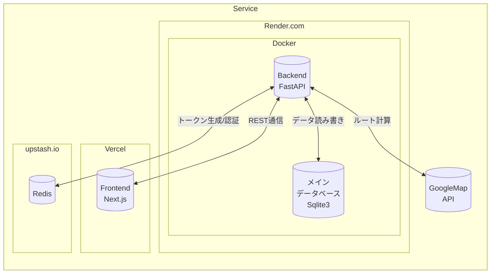

# 城巡りアシスタントアプリケーション
## システム構成図

```mermaid
flowchart RL
    subgraph Service
    subgraph render[Render.com]
    subgraph Docker[Docker]
    back[("Backend \n FastAPI")]
    rdb[("メイン \n データベース \n Sqlite3")]
    end
    end
    subgraph Vercel[Vercel]
        front[("Frontend \n Next.js")]
    end
    subgraph Upstash[upstash.io]
        nosql[("Redis")]
    end
    back <--"トークン生成/認証"--> nosql
    back <--"REST通信"--> front
        back <--"データ読み書き"--> rdb
    api[("GoogleMap \n API")]
    back <--"ルート計算"--> api
    end
```
