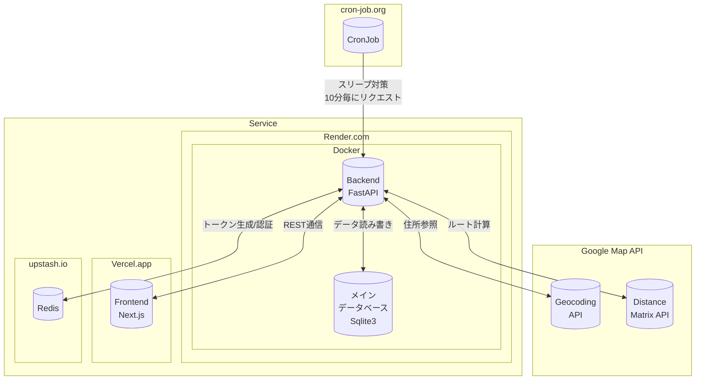

# 城巡りアシスタントアプリケーション
## システム構成図

```mermaid
flowchart TD
    subgraph google[Google Map API]
    api1[("Geocoding \n API")]
    api2[("Distance \n Matrix API")]
    end
    subgraph Service
    subgraph render[Render.com]
    subgraph Docker[Docker]
    back[("Backend \n FastAPI")]
    rdb[("メイン \n データベース \n Sqlite3")]
    end
    end
    subgraph Vercel[Vercel.app]
        front[("Frontend \n Next.js")]
    end
    subgraph Upstash[upstash.io]
        nosql[("Redis")]
    end
    back <--"トークン生成/認証"--> nosql
    back <--"REST通信"--> front
    back <--"データ読み書き"--> rdb
    back <--"ルート計算"--> api2
    back <--"住所参照"--> api1
    end
    
    subgraph CronJob[cron-job.org]
    job[(CronJob)]
    end
    job --"スリープ対策 \n 10分毎にリクエスト"-->back
```
