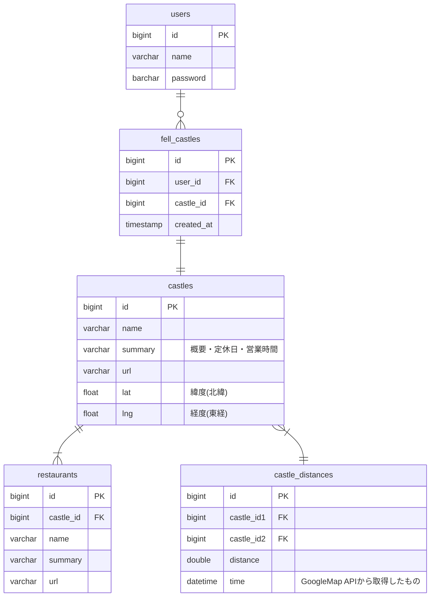

# API Document
## ER Diagram

## Endpoints
|Request Method|Route|Summary|
|---|---|---|
|GET|/castles|城の情報|
|GET|/castles/{castle_id}|城の詳細情報|
|POST|/travel|最短経路検索|
|POST|/user/signin|ログイン|
|POST|/user/signup|アカウント登録|
|GET|/log/{user_id}|今まで落とした城|
